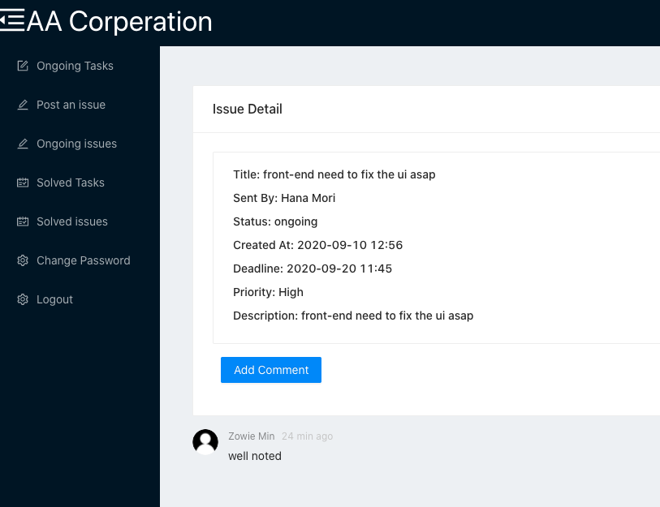

  

# About Issue Tracker

Help employees to post and receive tickets from each other and keep track of the tickets.
Features

Employee panel including tickets CRUD operations and add comments

Admin panel to add/delete employee accounts and department settings

User authentication

# How to use issue_tracker

Create a folder called db_credentials and export your db credentials including user,host,database,password,port

Add your token secret in .env ex: TOKEN_SECRET = \*\*\*\*

Under root folder, run "yarn configure"

Under the client folder, run"yarn start"

If you need to change the initial seeds,modilfy the /bin/sql/seeds
